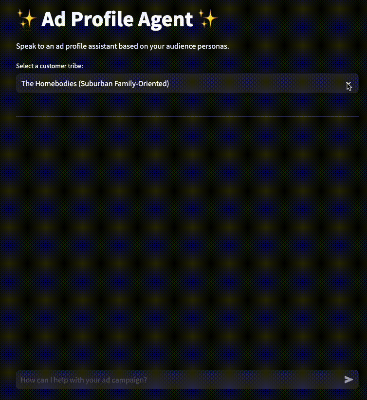
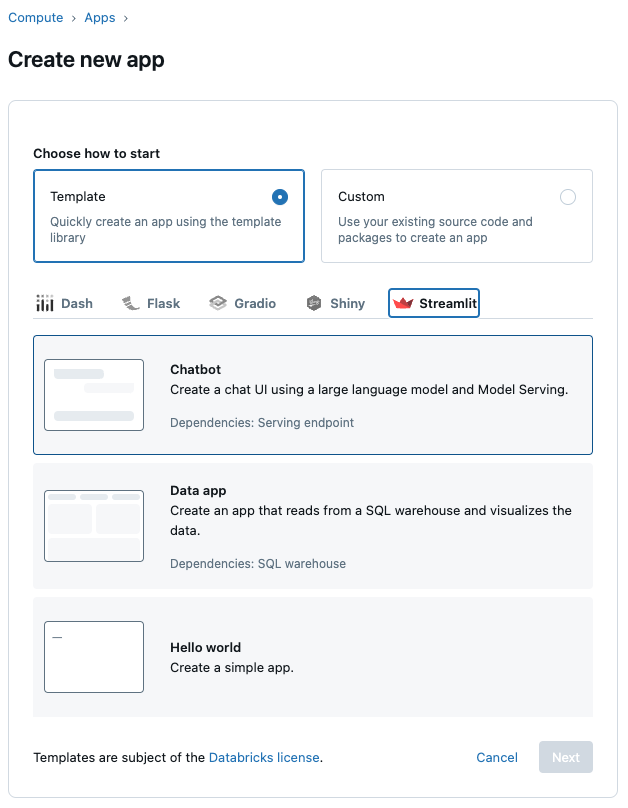

# AI Audience Profiles
This repo contains the notebooks for creating AI agent profiles for ad targeting. For marketers, traditional focus groups and ad targeting is slow and costly.
Classic segmentation helps group customers and build personas/profiles but lacks qualitative insights and doesn’t allow for testing and iterating ideas. The problem to solve is, what if you could instantly ask, *“How would my target audience respond to this ad?”.*

## The Solution: Synthetic Focus Group with Agent AI
- Step 1: Cluster structured customer data (demographics) using traditional methods (e.g. K-means)
- Step 2: Enrich segments with unstructured data (social media posts) to build realistic audience personas using LLM
- Step 3: AI agent evaluates and responds to ad content like a real audience (optional - RAG tool to leverage previous successful campaigns to guide agent output)
- Step 4: Databricks app as a front-end to let user interact with agent and get AI-driven feedback

  

## How to set up
This solution was tested on both serverless and classic compute clusters (15.4 ML runtime). It is recommended to run on either of these configurations.
1. Edit `00_setup` notebook to set the config, schema, volume paths, and vector search details
2. Run notebooks in order (make sure to substitute *VS_INDEX_NAME* in `04_profile_agents`)
3. (Optional) To create an app, [use the UI to set-up](https://docs.databricks.com/aws/en/dev-tools/databricks-apps/app-development#how-do-i-create-an-app-in-the-databricks-apps-ui) a Streamlit app with the Chatbot template and set the serving endpoint to the endpoint created in step 2. Then replace the template code with the code in `databricks_app`

