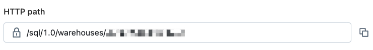
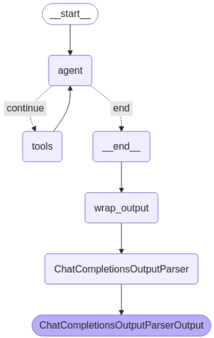
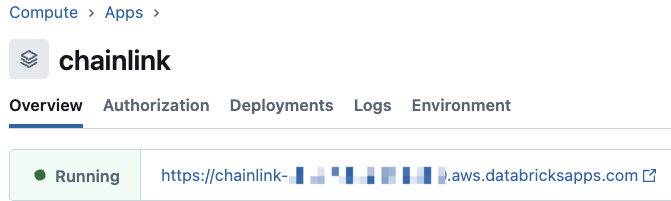
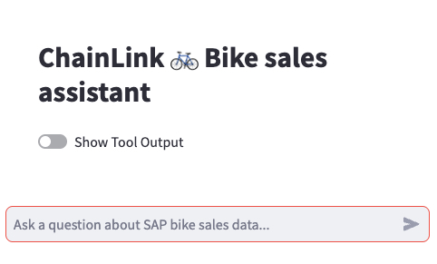

# SAP Bike Sales Agent

This repo contains a companion codebase for the Databricks blog _Integrating Knowledge Graphs and Databricks Agents for AI-Powered Insights_

Follow the prerequisites and run the code to create an agentic chat application with supply chain data context using Databricks. Then chat with your agent to explore Bike Sales data and ask questions about how to optimize the supply chain!

## Prerequisites
- Databricks workspace with the following features/permissions enabled:
  - Unity Catalog (USE CATALOG permission on at least one catalog)
  - DBSQL Serverless Warehouse (with CAN USE permission)
  - Serverless Notebooks and Mosaic AI Model Serving
  - [Databricks Apps](https://docs.databricks.com/aws/en/dev-tools/databricks-apps)
  - Secret Scope (MANAGE permissions on at least one scope)
- Neo4j Aura Instance
  - Create an account and deploy a Free instance by following [the directions here](https://neo4j.com/docs/aura/classic/auradb/getting-started/create-database/)
  - Be sure to save the **User name** and **Generated password** when creating the instance
  - [Add the Host URL and password to the Databricks Secret Scope](https://docs.databricks.com/aws/en/security/secrets/example-secret-workflow)

## Steps
Once the prerequisites have been met, follow the steps below to deploy the supply chain agent. Each notebook has detailed instructions.
#### Initialize Resources
1. Clone the repo to a new [Git Folder](https://docs.databricks.com/aws/en/repos/get-access-tokens-from-git-provider) in your home directory
2. Open the **00_init** notebook, connect to Serverless compute, and run the first four cells
3. Update the widget values
    - catalog (the name of the catalog where assets will be stored, this can be an existing catalog)
    - schema (the name of the schema where assets will be stored)
    - secret_scope (the name of the secret scope created as a prerequisite)
    - warehouse_id (the ID of the Serverless SQL warehouse as found at the end of the HTTP path)
    
4. Run the remainder of the notebook to update the config file and create the necessary resources
#### Load to Neo4j
5. Open the **01_load_to_neo4j** notebook, connect to Serverless compute
6. Run the notebook to populate the Graph Database created as a prerequisite
#### Create the Agent
7. Open the **02_agent** notebook, connect to Serverless compute
8. Run the notebook to create the agent chain and log the experiment to MLflow
  
9. Open the **03_driver** notebook, connect to Serverless compute
10. Run the notebook to deploy the agent to model serving and create the [Review App](https://docs.databricks.com/aws/en/generative-ai/agent-evaluation/review-app)
#### Create the App
11. Open the **04_deploy_app** notebook, connect to Serverless compute
12. Run the notebook to create the chat interface
13. Navigate to the app's details page and click the URL to access the agent

## Dataset Details
The SAP Bike Sales dataset is provided as sample content for exploring SAP Datasphere. The CSV files can be found at https://github.com/SAP-samples/datasphere-content/tree/main/Sample_Bikes_Sales_content (Apache 2.0 License).

The Cypher query used to load the dataset was adapted from the open source project https://github.com/neo4j-partners/blog-load-SAP-data-cypher-queries (Apache 2.0 License). This project was provided as a companion to the [blog here](https://neo4j.com/blog/graph-data-science/explore-sap-data-neo4j-graph-erp/).

## Dependencies

| Package | Version | License |
| ----------- | ----------- | ----------- |
| PyYAML | Latest | MIT License (MIT) |
| py2neo | Latest | Apache-2.0 |
| mlflow | Latest | Apache-2.0 |
| pydantic | Latest | MIT License (MIT) |
| langchain | >0.2.16 | MIT License (MIT) |
| langchain-community | >0.2.16 | MIT License (MIT) |
| databricks_langchain | Latest | MIT License (MIT) |
| langchain_neo4j | Latest | MIT License (MIT) |
| langgraph | 0.2.74 | MIT License (MIT) |
| langgraph-checkpoint | >1.0.12 | MIT License (MIT) |